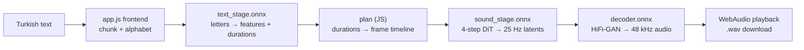
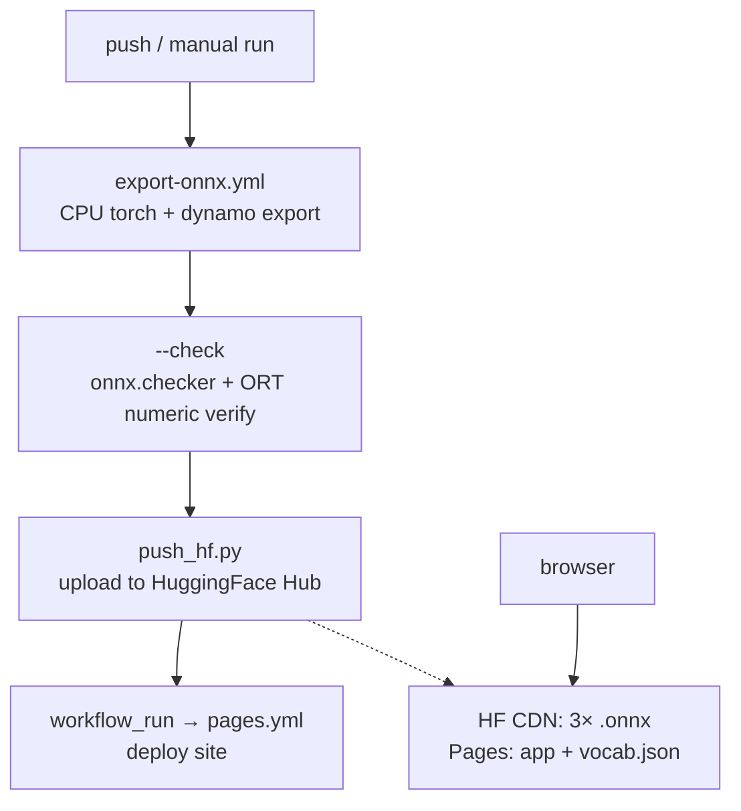

# ⚡ EMA Lightning Web (ONNX)

**Offline Turkish TTS in your browser.**

[🇹🇷 Türkçe](README.tr.md) · **▶️ Live:** https://fr0stb1rd.github.io/ema-lightning-web/

[](https://github.com/fr0stb1rd/ema-lightning-web/actions/workflows/pages.yml)
[](https://github.com/fr0stb1rd/ema-lightning-web/actions/workflows/export-onnx.yml)

Turkish text-to-speech web app — **runs fully in the browser**.
No server, no API key, your voice never leaves your device.

Model: [canberk7/ema-lightning](https://github.com/canberk7/ema-lightning) —
8.6M parameters (~34 MB), Apache-2.0, 0.92% WER on Freya-TR-Eval.
This repo converts the model to ONNX and runs it in the browser with
`onnxruntime-web` + WebAudio.

## Usage

1. Open: https://fr0stb1rd.github.io/ema-lightning-web/
2. Type text, press **Speak**. The first sentence starts playing while the rest
   is still being generated.
3. On first launch the models download once (~36 MB, then cached in the browser
   for a day).

> 🔢 **Write numbers out in words** (e.g. "bin iki yüz elli lira") — automatic
> number/date reading is not in this version (see Limitations).

## Architecture

The original PyTorch pipeline (`ema-lightning` package) is split into three
ONNX stages so the browser can stream: each text piece is planned, thought and
decoded independently, and playback starts with the first piece.



| Stage | In | Out |
|---|---|---|
| `text_stage.onnx` | `ids [B,L]` int64, `mask [B,L]` bool | `h [B,L,224]` float32, `dur [B,L]` float32 |
| `plan` (JS, from `engine.py`) | `dur`, word map | `fw [T]`, `fp [T]` frame timeline |
| `sound_stage.onnx` | `h, dur, masks, maps, noise [B,4,T,64]` | `latents [B,T,64]` float32 |
| `decoder.onnx` | `z [B,64,T]` float32 | `audio [B,S]` float32, 48 kHz |

The frame planning math (duration rounding, `repeat_interleave`, intra-word
positions) and the windowed decoder (1 s first window + 8-frame context, then
4 s windows) are ported 1:1 from `engine.py`. Noise uses its own PRNG, so the
same seed does **not** reproduce the Python audio — the speech itself is valid.

### Runtime

- **Providers:** `['webgpu', 'wasm']` with the default `ort.min.js` bundle
  (includes all released backends). No COOP/COEP on Pages → WASM is
  single-threaded automatically.
- **No UI freeze:** `ort.env.wasm.proxy = true` runs inference in a worker,
  with main-thread fallback.
- **Cache:** models are cache-first in Cache Storage (`ema-lightning-web-v1`,
  1-day TTL) — repeat visits use zero bandwidth.
- **History:** generations stay in memory + metadata in `localStorage`;
  lock-screen controls via Media Session API.

### Why HuggingFace Hub for the weights?

| Option | Verdict |
|---|---|
| GitHub Releases | ✗ blocked — `release-assets.githubusercontent.com` sends no `Access-Control-Allow-Origin`, browsers refuse the download (measured) |
| In the Pages repo | ✗ works, but every re-export adds ~36 MB to git history forever |
| **HuggingFace Hub** | ✓ `*.cdn.hf.co` sends `Access-Control-Allow-Origin: *` (measured); versioned storage, stable `resolve/main` URLs |

`vocab.json` (778 bytes) ships with the site — small Hub files are served with
a restrictive CORS policy, so it stays same-origin.

## Development

Build and deploy flow — everything is automated, the only manual steps are the
one-time Hub token and pressing **Run workflow**:



### 1. Producing the ONNX models (once is enough)

**Prerequisite (once):** create a public model repo named `ema-lightning-web-onnx`
at [huggingface.co/new-model](https://huggingface.co/new-model), then mint a write
token at [huggingface.co/settings/tokens](https://huggingface.co/settings/tokens)
and add it as `HF_TOKEN` under repo → **Settings** → **Secrets** → **Actions**.
(`push_hf.py` creates the repo if missing, but the token is required.)

**Recommended — via GitHub Actions:**

Repo → **Actions** → `export-onnx` → **Run workflow**.
When done, `models/*.onnx` is uploaded to HuggingFace Hub (with an Apache-2.0
model card carrying `base_model: canberkkkkkk/ema-lightning`, which lists this
repo under the original's Quantizations) and `vocab.json` is committed here.

**Alternative — on your own machine:**

```bash
pip install -r requirements-export.txt   # pinned list (CPU torch)
pip install onnxruntime && python export_onnx.py --check  # recommended: numerically verified
export HF_TOKEN=hf_... && python push_hf.py  # upload to Hub
git add vocab.json && git commit -m "vocab" && git push
```

The converter uses PyTorch's recommended `torch.export`-based exporter
(`dynamo=True`); opset default, dynamic axes. Falls back to the legacy exporter
with a warning on failure.

### 2. Verification

`--check` replays the original `Engine.piece/plan/think` path on
"merhaba dünya." and compares every stage against `onnxruntime`
(`torch.testing.assert_close`): text features + durations (1e-4), latents (1e-3),
decoded audio (1e-4). The JS text frontend (`alphabet`) is covered by a Node
check against the real `vocab.json` (Turkish letters preserved, `I→ı`/`İ→i`,
foreign accents stripped).

### 3. Publishing

Repo → **Settings** → **Pages** → Source: **GitHub Actions**.
(`.github/workflows/pages.yml` is ready; every push deploys automatically.
Note: pushes made with `GITHUB_TOKEN` don't trigger workflows, so the export
job's commits are deployed via the `workflow_run` trigger.)

### Files

| File | What it is |
|---|---|
| `index.html` | UI skeleton + style (light/dark theme, mobile-friendly) |
| `app.js` | UI (`@geajs/core` runtime, TR/EN) + inference pipeline |
| `export_onnx.py` | PyTorch → ONNX converter (+ `--check` verification) |
| `push_hf.py` | `models/*.onnx` → HuggingFace Hub upload (+ model card) |
| `requirements-export.txt` | Converter dependencies (pinned, CPU torch) |
| `.github/workflows/pages.yml` | Pages deploy |
| `.github/workflows/export-onnx.yml` | One-click convert + upload to Hub |
| `vocab.json` | Alphabet + sampling info (on site, tiny) |

## Limitations

- **No number/date reading.** The original `normalizer-tr` Python package is not in
  the browser; `app.js` only lowercases + filters the alphabet. Inputs like
  "1.250.000 TL" are read digit by digit.
- **No seed parity.** The browser uses its own PRNG; the same text yields valid
  Turkish speech but not bit-identical to the Python output.
- **Speed:** desktop CPU Python is ~6× realtime; in WASM expect ~1–2× on short
  sentences. Long text is produced piece by piece while the first piece plays.
- Single voice, Turkish only — the original model's limits apply as-is.

## Credits and license

- Model and weights: [Canberk Aslan (canberk7/ema-lightning)](https://github.com/canberk7/ema-lightning), Apache-2.0 (commercial use included).
- Text normalization (original): [Erdem Tuna (normalizer-tr)](https://github.com/erdemtuna/normalizer-tr).
- Browser reactivity: [Gea (`@geajs/core`)](https://github.com/dashersw/gea).
- Code in this repo: Apache-2.0.
