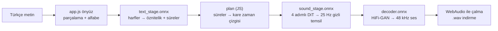
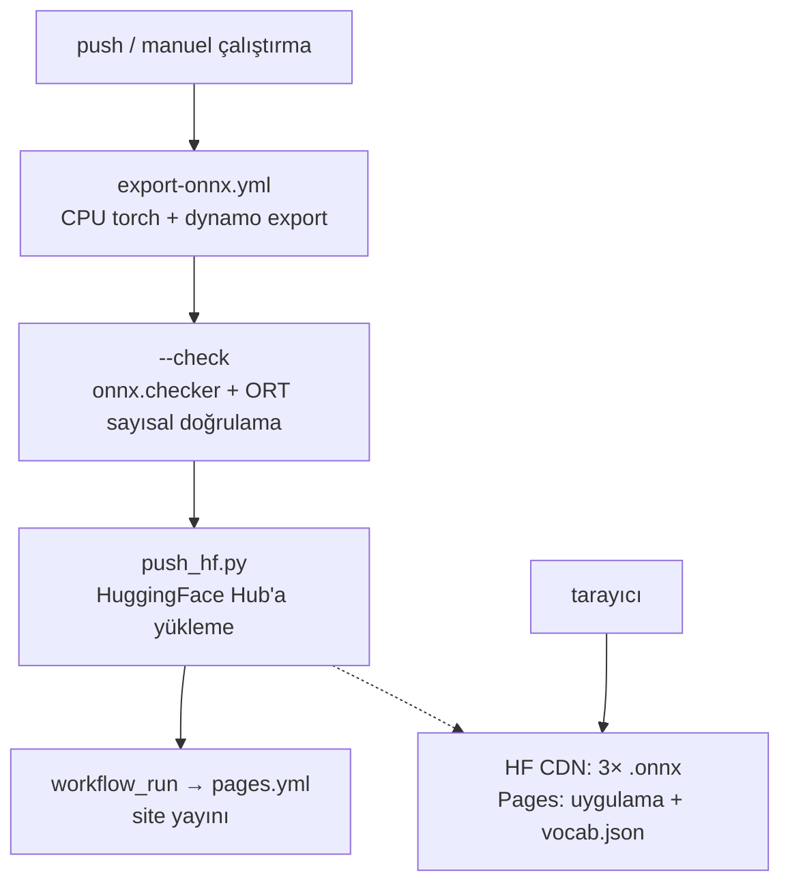

# ⚡ EMA Lightning Web (ONNX)

**Tarayıcıda çevrimdışı Türkçe TTS — Offline Turkish TTS in your browser.**

[🇬🇧 English](README.md) · **▶️ Canlı:** https://fr0stb1rd.github.io/ema-lightning-web/

[](https://github.com/fr0stb1rd/ema-lightning-web/actions/workflows/pages.yml)
[](https://github.com/fr0stb1rd/ema-lightning-web/actions/workflows/export-onnx.yml)

Türkçe metinden sese (TTS) web uygulaması — **tamamen tarayıcıda çalışır**.
Sunucu yok, API anahtarı yok, sesiniz cihazınızdan çıkmaz.

Model: [canberk7/ema-lightning](https://github.com/canberk7/ema-lightning) —
8,6M parametre (~34 MB), Apache-2.0, Freya-TR-Eval'de %0,92 WER.
Bu repo, modeli ONNX'e çevirip `onnxruntime-web` + WebAudio ile tarayıcıda koşturur.

## Kullanım

1. Sayfayı açın: https://fr0stb1rd.github.io/ema-lightning-web/
2. Metni yazın, **Sesi Üret**'e basın. İlk cümle çalmaya başlarken kalanı
   arka planda üretilir.
3. İlk açılışta modeller bir kez indirilir (~36 MB, sonra bir gün tarayıcıda
   önbelleklenir).

> 🔢 **Sayıları yazıyla yazın** (örn. "bin iki yüz elli lira") — otomatik
> sayı/tarih okunuşu bu sürümde yok (bkz. Sınırlamalar).

## Mimari

Orijinal PyTorch hattı (`ema-lightning` paketi) üç ONNX aşamasına bölündü;
tarayıcı her metin parçasını bağımsız planlayıp üretip çözüyor, ilk parça
hazır olur olmaz çalıyor.



| Aşama | Girdi | Çıktı |
|---|---|---|
| `text_stage.onnx` | `ids [B,L]` int64, `mask [B,L]` bool | `h [B,L,224]` float32, `dur [B,L]` float32 |
| `plan` (JS, `engine.py`'den port) | `dur`, kelime haritası | `fw [T]`, `fp [T]` kare zaman çizgisi |
| `sound_stage.onnx` | `h, dur, maskeler, haritalar, gürültü [B,4,T,64]` | `latents [B,T,64]` float32 |
| `decoder.onnx` | `z [B,64,T]` float32 | `audio [B,S]` float32, 48 kHz |

Kare planlama matematiği (süre yuvarlama, `repeat_interleave`, kelime-içi
konumlar) ve pencereli çözücü (8 kare bağlamlı 1 sn ilk pencere, sonra 4 sn
pencereler) `engine.py`'den birebir port edildi. Gürültü kendi üretecini
kullanır; aynı seed Python sesini **birebir vermez** — konuşmanın kendisi geçerlidir.

### Çalışma ortamı

- **Sağlayıcılar:** varsayılan `ort.min.js` paketiyle `['webgpu', 'wasm']`
  (yayınlanmış tüm arka uçları içerir). Pages COOP/COEP göndermediği için WASM
  otomatik tek threade düşer.
- **Donma yok:** `ort.env.wasm.proxy = true` çıkarımı worker'a taşır,
  kurulamazsa ana thread yedeği var.
- **Önbellek:** modeller Cache Storage'da cache-first (`ema-lightning-web-v1`,
  1 gün vade) — tekrar ziyaretlerde sıfır trafik.
- **Geçmiş:** üretimler bellekte + meta `localStorage`'da; kilit ekranı
  kontrolleri Media Session API ile.

### Ağırlıklar neden HuggingFace Hub'da?

| Seçenek | Hüküm |
|---|---|
| GitHub Releases | ✗ olmaz — `release-assets.githubusercontent.com` yanıtında `Access-Control-Allow-Origin` yok, tarayıcı indirmeyi reddeder (ölçüldü) |
| Pages reposunun içi | ✗ çalışır ama her yeniden export git geçmişine ~36 MB ekler |
| **HuggingFace Hub** | ✓ `*.cdn.hf.co` yanıtında `Access-Control-Allow-Origin: *` var (ölçüldü); sürümlü depolama, sabit `resolve/main` adresleri |

`vocab.json` (778 bayt) siteyle birlikte gelir — Hub küçük dosyaları kısıtlı
CORS politikasıyla sunduğu için aynı-origin'da durur.

## Geliştirme

Derleme ve yayın akışı — tek seferlik Hub token'ı ve **Run workflow** tuşu
dışında her şey otomatik:



### 1. ONNX modellerini üretme (bir kez yeterli)

**Ön koşul (bir kez):** [huggingface.co/new-model](https://huggingface.co/new-model)
adresinden `ema-lightning-web-onnx` adında public model deposu açın, sonra
[huggingface.co/settings/tokens](https://huggingface.co/settings/tokens) adresinden
yazma yetkili token üretip repo → **Settings** → **Secrets** → **Actions** altında
`HF_TOKEN` adıyla ekleyin. (Repo yoksa `push_hf.py` kendisi açar, ama token şart.)

**Önerilen — GitHub Actions ile:**

Repo → **Actions** → `export-onnx` → **Run workflow**.
İş bitince `models/*.onnx` HuggingFace Hub'a yüklenir (Apache-2.0 model kartı ve
`base_model: canberkkkkkk/ema-lightning` etiketiyle — bu sayede kayıt orijinalin
Quantizations listesinde görünür), `vocab.json` buraya commitlenir.

**Alternatif — kendi bilgisayarınızda:**

```bash
pip install -r requirements-export.txt   # sürümleri sabitli liste (CPU torch)
pip install onnxruntime && python export_onnx.py --check  # önerilen: sayısal doğrulamalı
export HF_TOKEN=hf_... && python push_hf.py  # Hub'a yükle
git add vocab.json && git commit -m "vocab" && git push
```

Dönüştürücü, PyTorch'un önerdiği `torch.export` tabanlı exporter'ı
(`dynamo=True`) kullanır; opset varsayılan, eksenler dinamik. Başarısız olursa
eski exporter'a düşer ve uyarır.

### 2. Doğrulama

`--check`, orijinal `Engine.piece/plan/think` yolunu "merhaba dünya." ile
çalıştırıp her aşamayı `onnxruntime` ile karşılaştırır
(`torch.testing.assert_close`): metin öznitelikleri + süreler (1e-4), gizli
temsil (1e-3), çözülmüş ses (1e-4). JS metin önyüzü (`alphabet`) gerçek
`vocab.json` ile Node kontrolünden geçer (Türkçe harfler korunur, `I→ı`/`İ→i`,
yabancı aksanlar soyulur).

### 3. Yayınlama

Repo → **Settings** → **Pages** → Source: **GitHub Actions**.
(`.github/workflows/pages.yml` hazır; her push'ta otomatik yayınlanır.
Not: `GITHUB_TOKEN` ile yapılan push yeni run tetiklemez; export işinin
commitleri `workflow_run` tetikleyicisiyle yayınlanır.)

### Dosyalar

| Dosya | Ne işe yarar |
|---|---|
| `index.html` | Arayüz iskeleti + stil (açık/koyu tema, mobil uyumlu) |
| `app.js` | Arayüz (`@geajs/core` runtime, TR/EN) + çıkarım hattı |
| `export_onnx.py` | PyTorch → ONNX dönüştürücü (+ `--check` doğrulaması) |
| `push_hf.py` | `models/*.onnx` → HuggingFace Hub'a yükleme (+ model kartı) |
| `requirements-export.txt` | Dönüştürme bağımlılıkları (sürümleri sabitli, CPU torch) |
| `.github/workflows/pages.yml` | Pages yayını |
| `.github/workflows/export-onnx.yml` | Tek tıkla dönüştür + Hub'a yükle |
| `vocab.json` | Alfabe + örnekleme bilgisi (sitede, küçük) |

## Sınırlamalar

- **Sayı/tarih okunuşu yok.** Orijinal `normalizer-tr` Python paketi tarayıcıda
  yok; `app.js` yalnızca küçük harf + alfabe filtresi yapıyor. "1.250.000 TL"
  gibi girdiler rakam rakam okunur.
- **Seed uyumu yok.** Tarayıcı kendi rastgele sayı üretecini kullanır; aynı
  metin geçerli Türkçe ses üretir ama Python çıktısıyla birebir aynı olmaz.
- **Hız:** masaüstü CPU'da Python ~6× gerçek zamanlı; WASM'da kısa cümlelerde
  ~1–2× bekleyin. Uzun metin ilk parça çalarken parça parça üretilir.
- Model tek ses, yalnızca Türkçe — orijinal modelin limitleri aynen geçerli.

## Teşekkür ve lisans

- Model ve ağırlıklar: [Canberk Aslan (canberk7/ema-lightning)](https://github.com/canberk7/ema-lightning), Apache-2.0 (ticari kullanım dahil).
- Metin normalleştirme (orijinal): [Erdem Tuna (normalizer-tr)](https://github.com/erdemtuna/normalizer-tr).
- Tarayıcı reaktivitesi: [Gea (`@geajs/core`)](https://github.com/dashersw/gea).
- Bu repodaki kod: Apache-2.0.
